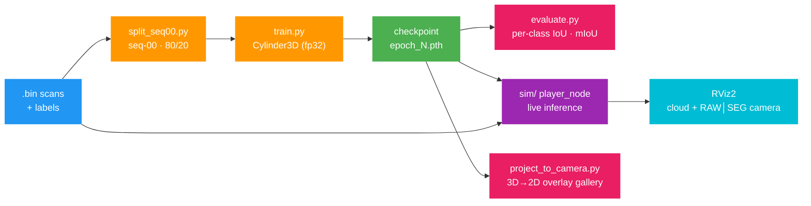

# lidarseg — 3D LiDAR Semantic Segmentation, end to end

A complete LiDAR semantic-segmentation project on **SemanticKITTI**, from raw
`.bin` scans to a **live RViz2 demo running the model online** — in one repo.

Two halves that used to live apart, now under one roof:

1. **Train & evaluate** (`scripts/`, `configs/`, `docs/`) — prepare the data,
   train **Cylinder3D**, weight the classes, and measure real **mIoU**.
2. **Deploy live** (`sim/`) — a **ROS 2 (Humble)** node that replays a sequence
   and runs the trained model **per frame**, publishing a class-colored point
   cloud and a `RAW | SEGMENTATION` camera panel for RViz2.

> New to LiDAR data or this project? Read the docs in order — they assume a 2D
> vision background and explain everything from the raw `.bin` up.


*The `sim/` ROS 2 node replaying SemanticKITTI seq 00: live Cylinder3D inference →
class-colored 3D point cloud (right) with the RAW | SEGMENTATION camera panel
(left). The model infers each frame as it plays — genuine online perception, not
a recording.*

---

## End-to-end pipeline



The same checkpoint feeds both the **offline mIoU evaluation** and the **online
RViz2 demo** — the number you report and the thing you can watch run are the same
model.

---

## 📚 Documentation (read in order)

| # | Doc | Answers |
|---|-----|---------|
| 1 | [docs/01_dataset_preparation.md](docs/01_dataset_preparation.md) | What LiDAR data *is*, every file's datatype, the raw→19-class mapping, the pkl index, and the 80/20 split. |
| 2 | [docs/02_model_and_training.md](docs/02_model_and_training.md) | Cylinder3D's architecture and **every training decision + why** (batch size, fp32, LR, schedule, the CE+Lovász loss). |
| 3 | [docs/03_class_weighting.md](docs/03_class_weighting.md) | What class weighting is, **what `CLASS_WEIGHT[0]=5.0` actually means**, how to optimize one class alone, and the data-driven helper. |
| 4 | [docs/04_evaluation_miou.md](docs/04_evaluation_miou.md) | Why **mIoU**, not the 88 % point accuracy, is the metric that matters — with the one command to compute it. |
| 5 | [docs/05_lidar_to_camera_projection.md](docs/05_lidar_to_camera_projection.md) | **How a 3D segmentation is drawn on a 2D photo**, bit by bit, with the projection math and a full image gallery. |
| 6 | [docs/06_make_gif_from_video.md](docs/06_make_gif_from_video.md) | Turning a recorded clip into a README **GIF / embedded video**. |
| 7 | [docs/07_sensor_geometry.md](docs/07_sensor_geometry.md) | **What the Velodyne actually sees** — the 64-beam vertical fan, vertical FOV, rings, sparsity-with-range, and LiDAR-as-a-2D-image. |
| 8 | [docs/08_how_distance_works.md](docs/08_how_distance_works.md) | **How distance is measured** (time-of-flight), range→(x,y,z) math, and the dataset by the numbers (density vs range, the 64 beams in the data). |

---

## 🗂 Project layout

```
lidarseg/
├── README.md                      ← you are here (the one front door)
├── env.sh                         source first: CUDA 13.0 + project paths
├── Makefile                       split | weights | train | resume | eval | viz | sim-build | sim-run
├── docs/                          the eight explainer docs above (+ docs/images/)
├── configs/
│   ├── cylinder3d_seq00.py        clean training config (inherits stock, ~4 overrides)
│   └── cylinder3d_seq00_weighted.py   per-class-weighted variant
├── scripts/                       ── TRAIN & EVALUATE ──
│   ├── split_seq00.py             filter full infos → seq00, 80/20 split (reproducible)
│   ├── compute_class_weights.py   scan labels → ready-to-paste class_weight vector
│   ├── train.py / train.sh        train (patch-safe Runner; no --cfg-options wall)
│   ├── resume.sh                  resume the latest checkpoint
│   ├── evaluate.py / evaluate.sh  per-class IoU + mIoU over the whole val split
│   ├── visualize.py               GT / prediction / error PNGs + PLYs for one frame
│   ├── project_to_camera.py       step-by-step 3D→2D overlay images (docs/images/)
│   ├── sensor_geometry.py         the 64-beam fan, vertical FOV, range image
│   ├── dataset_overview.py        time-of-flight + distance/density/beam stats
│   └── make_gif.sh                video → optimized GIF for the README
└── sim/                           ── DEPLOY LIVE (ROS 2 Humble) ──
    └── src/kitti_seg_sim/         ament_python package: live inference node
        ├── launch/sim.launch.py   node + optional RViz, all params exposed
        ├── config/kitti_seg.rviz  RViz2 layout: cloud view + compare camera panel
        └── kitti_seg_sim/
            ├── player_node.py     the node: params, publishers, timer loop
            ├── inference.py       SegModel — load checkpoint, predict per scan
            ├── projection.py      project points → image, build overlay/compare
            ├── pointcloud.py      numpy → PointCloud2 (xyz + packed rgb)
            ├── calib.py           parse calib.txt (P2, Tr) + rot→quat
            └── colormap.py        19-class names, palette, raw→learning LUT
```

**Why this shape:** every training knob lives in a named config, each task is one
`make` target, and the docs explain the *why*. The heavy lifting still uses the
installed `mmdetection3d`; this project is the clean front door to it — now
including the live-deployment half.

---

## ⚙️ Prerequisites (already set up on this machine)

**Training / evaluation**
- PyTorch 2.12.0+cu130, **CUDA toolkit 13.0** (`CUDA_HOME=/usr/local/cuda-13.0`)
- mmdet3d 1.4.0 · mmcv 2.1.0 · mmdet 3.3.0 · spconv-cu120 · `numpy<2`
- Data at `~/Autonomy/semantickitti/dataset/sequences/00/`
- Baseline checkpoint at
  `~/Autonomy/mmdetection3d/work_dirs/cylinder3d_4xb4-3x_semantickitti/epoch_5.pth`

**Live demo (`sim/`)**
- **ROS 2 Humble** (`rclpy`, `sensor_msgs`, `cv_bridge`, `tf2_ros`, `rviz2`)
- Same `torch` + `mmdet3d` stack as above, plus `open3d`, `opencv-python`
- **`setuptools < 80`** so `colcon build` works (≥80 removed `setup.py install`)
- Sequence at `~/Autonomy/semantickitti/dataset/sequences/00/` with
  `velodyne/`, `labels/`, `image_2/`, and `calib.txt`

See the repo-root `PROGRESS.md` for how that environment was built (it was not
trivial).

---

## 🚀 Quickstart — train & evaluate

```bash
cd ~/Autonomy/lidarseg
source env.sh

# (re)generate the seq-00 train/val pkls  — verified to match what's on disk
make split

# resume training the baseline toward convergence
make resume

# proper evaluation: per-class IoU + mIoU over the 909 val frames
make eval

# render a frame (GT / prediction / error) to ~/Autonomy/viz/
make viz
```

### Class-weighting experiment
```bash
make weights                       # data-driven per-class weights (optional)
# paste into configs/cylinder3d_seq00_weighted.py (or bump one class), then:
python3 scripts/train.py    --config configs/cylinder3d_seq00_weighted.py
python3 scripts/evaluate.py --config configs/cylinder3d_seq00_weighted.py \
        --checkpoint ~/Autonomy/mmdetection3d/work_dirs/cylinder3d_seq00_weighted/epoch_5.pth
```

---

## 🤖 Live perception — the `sim/` ROS 2 node

`sim/` is a self-contained colcon workspace holding one `ament_python` package,
`kitti_seg_sim`. It streams a SemanticKITTI sequence frame-by-frame, runs the
trained **Cylinder3D** model **live** on each scan, and publishes everything RViz2
needs: a class-colored point cloud, the raw camera image, and a
segmentation-overlaid camera view — side by side.

### Build

```bash
cd ~/Autonomy/lidarseg/sim
source /opt/ros/humble/setup.bash
colcon build --packages-select kitti_seg_sim   # or: make sim-build (from repo root)
source install/setup.bash
```

### Run

```bash
# live model predictions + RViz (default)
ros2 launch kitti_seg_sim sim.launch.py            # or: make sim-run

# ground-truth colors (no model, ~7.5 fps), faster
ros2 launch kitti_seg_sim sim.launch.py color_source:=gt   # or: make sim-gt

# start on the validation split, no RViz (topics only)
ros2 launch kitti_seg_sim sim.launch.py start_frame:=3633 rviz:=false
```

In RViz the camera panel shows **RAW | SEGMENTATION**; the 3D view shows the
class-colored cloud. Fixed frame is `velodyne`; the PointCloud2 *Color
Transformer* is **RGB8**.

### Published topics

| Topic | Type | Description |
|-------|------|-------------|
| `/kitti/points` | `sensor_msgs/PointCloud2` | xyz + packed `rgb`, frame `velodyne`, colored by class |
| `/kitti/camera/image` | `sensor_msgs/Image` | raw left color camera, `bgr8`, frame `camera` |
| `/kitti/camera/overlay` | `sensor_msgs/Image` | segmentation projected onto the image |
| `/kitti/camera/compare` | `sensor_msgs/Image` | **RAW \| SEGMENTATION** side by side (RViz panel) |
| `/kitti/camera/info` | `sensor_msgs/CameraInfo` | intrinsics from calib `P2` |
| `/tf_static` | — | `velodyne → camera` from calib `Tr` |

### Key parameters

| Parameter | Default | Meaning |
|-----------|---------|---------|
| `color_source` | `pred` | `pred` = run model · `gt` = ground-truth labels |
| `rate_hz` | `10.0` | target playback rate (inference may cap it lower) |
| `start_frame` / `end_frame` | `0` / `-1` | frame index range (`-1` = last available) |
| `loop` | `true` | restart at the end |
| `data_root` | seq 00 path | dataset sequence directory |
| `model_checkpoint` | `epoch_5.pth` | checkpoint to load |
| `device` | `cuda:0` | inference device |

### Performance

| Mode | Rate | VRAM |
|------|------|------|
| `gt` (labels) | ~7.5 fps | — |
| `pred` (live inference) | ~3.6 fps (model loads ~6 s once) | ~3 GB |

Only ~18.9k of the ~124k points per scan land in the forward camera FOV — the
camera looks forward, the LiDAR is 360°, so the overlay covers the front only.

---

## 🔧 Editing guide

| Want to… | Edit |
|----------|------|
| Point at different data / split | `configs/cylinder3d_seq00.py` (`data_root`, `ann_file`) |
| Change batch size / workers | `configs/cylinder3d_seq00.py` → `train_dataloader` |
| Tune class weights (one or all) | `configs/cylinder3d_seq00_weighted.py` → `CLASS_WEIGHT` |
| Re-make the seq-00 split | `scripts/split_seq00.py` (`--random`, `--train-frac`) |
| Recolor visualizations / live cloud | `scripts/visualize.py` → `PALETTE`, `sim/.../colormap.py` → `PALETTE` |
| Regenerate the 3D→2D image gallery | `scripts/project_to_camera.py --frame NNNNNN` |
| Use a newer checkpoint in the live demo | launch arg `model_checkpoint:=…` |
| Change the live overlay look (size, blend) | `sim/.../projection.py` → `make_overlay` |
| Adjust the RViz layout | `sim/.../config/kitti_seg.rviz` |
| Turn a recorded clip into a README GIF | `scripts/make_gif.sh clip.mp4` |

After editing a config, just re-run `make train` / `make eval` — no rebuild. After
editing Python in `sim/`, no rebuild is needed if you built with
`colcon build --symlink-install`; otherwise re-run the build.

---

## ⚠️ Stack gotchas (don't relearn the hard way)

- **fp32 only.** Cylinder3D + AMP/fp16 crashes (spconv `feats_reduce_kernel`
  has no Half kernel). The config stays fp32 on purpose.
- **`weights_only` checkpoints.** Our checkpoints embed an mmengine `ConfigDict`;
  `train.py`/`evaluate.py`/`sim` patch `torch.load(weights_only=False)` so loading
  works under PyTorch ≥2.6. Don't remove that patch.
- **`colcon build` errors on `setup.py install`** → `pip install "setuptools<80"`.
- **Cloud is one solid color in RViz** → set PointCloud2 *Color Transformer* to **RGB8**.
- **Our val = tail of seq 00**, not the official seq-08 benchmark — mIoU here is
  for comparing *your own* runs, not the public leaderboard (see doc 4 §6).

---

## License

MIT. SemanticKITTI / KITTI data are CC BY-NC-SA — cite the original authors.
