# Model & training decisions — the questions

Every number below comes straight from
[`configs/cylinder3d_seq00.py`](../configs/cylinder3d_seq00.py) (our overrides) and
the stock Cylinder3D config it inherits. This doc answers: why Cylinder3D, how the
network is wired, why two losses, what changed for an 8 GB laptop, what the schedule
does, what training achieved, and how predictions are produced.

> Background on the data and the cylindrical voxels this model consumes:
> [01_data_and_sensor.md](01_data_and_sensor.md).

---

## Why Cylinder3D?

**Cylinder3D** is a 3D sparse-convolution U-Net designed *specifically* for
rotating-LiDAR semantic segmentation. Three reasons it's a good first choice:

1. **It's built for the sensor.** It voxelizes in **cylindrical** coordinates
   (ρ, θ, z), matching how a spinning LiDAR samples the world (dense near, sparse
   far). Cartesian-voxel methods waste capacity on empty far-away cubes. (See
   [01_data_and_sensor.md](01_data_and_sensor.md).)
2. **It's sparse, therefore cheap.** A LiDAR scan is ~99 % empty space. Cylinder3D
   uses **sparse convolutions** (via `spconv`) that only compute where points
   exist, so a 480×360×32 grid is tractable on an **8 GB laptop GPU**.
3. **It ships in MMDetection3D with a SemanticKITTI recipe** — a tested config,
   data pipeline, and schedule instead of building from zero.

The trade-off accepted: Cylinder3D is **fp32-only** in this stack (see below), and
a single scan takes ~0.28 s to infer. For learning the full 3D-seg pipeline on a
laptop, that's a fine price.

---

## How is the network wired (data → logits)?



```mermaid
%%{init: {"theme":"dark","themeVariables":{"primaryTextColor":"#fff","lineColor":"#00BFFF","primaryColor":"#1f2937","secondaryColor":"#374151","tertiaryColor":"#4b5563"}}}%%
flowchart LR
    P["points N×4\n(x,y,z,intensity)"]:::b --> V["cylindrical voxelize\n480×360×32"]:::o
    V --> E["SegVFE\nper-voxel features → 16-D"]:::g
    E --> B["Asymm3DSpconv\n3D sparse U-Net (base 32)"]:::g
    B --> H["Cylinder3DHead\n128→20 logits per point"]:::p
    H --> L["CE + Lovász loss\n(vs per-point labels)"]:::pk
    classDef b fill:#2196F3,color:#fff
    classDef o fill:#FF9800,color:#fff
    classDef g fill:#4CAF50,color:#fff
    classDef p fill:#9C27B0,color:#fff
    classDef pk fill:#E91E63,color:#fff
```

Piece by piece (all values from the config):

| Stage | Config | What it does |
|-------|--------|--------------|
| **Voxelization** | `voxel_type='cylindrical'`, `point_cloud_range=[0,-π,-4, 50,π,2]`, `grid_shape=[480,360,32]` | bucket points into cylindrical cells; 0–50 m radius, full 360°, −4…+2 m height |
| **Voxel encoder** | `SegVFE`, `in_channels=6`, `feat_channels=[64,128,256,256]`, `feat_compression=16` | turn the points inside each voxel (coords, intensity, offset to voxel centre — 6 numbers) into one **16-D feature per voxel** |
| **Backbone** | `Asymm3DSpconv`, `base_channels=32`, `input_channels=16` | an **asymmetric residual 3D sparse U-Net** — downsample→upsample with skips |
| **Head** | `Cylinder3DHead`, `channels=128`, `num_classes=20` | project each point's feature to **20 class logits** (19 classes + ignore slot) |

`num_classes=20`, not 19, because the ignore index (19) is a real output channel;
the loss just never *targets* it. (This 20-vs-19 detail matters for class weighting
— see [03_weighting_and_evaluation.md](03_weighting_and_evaluation.md).)

---

## Why cross-entropy **plus** Lovász — why two losses?

```python
loss_ce     = CrossEntropyLoss(use_sigmoid=False, loss_weight=1.0, class_weight=None)
loss_lovasz = LovaszLoss(loss_weight=1.0, reduction='none')
total = loss_ce + loss_lovasz
```

- **Cross-entropy** is the standard per-point classifier loss: "push the probability
  of the correct class up." Stable and easy to optimize, but it treats every *point*
  equally — so the few giant classes (road, vegetation) dominate the gradient.
- **Lovász-softmax** is a surrogate that **directly optimizes IoU** (the metric we
  actually care about — see
  [03_weighting_and_evaluation.md](03_weighting_and_evaluation.md)). Because IoU is
  *per-class*, Lovász cares about a small class's region as much as a big one's. It
  partially counteracts class imbalance on its own.

Using both = "classify each point correctly" (CE) **and** "make each class's
predicted region overlap the truth well" (Lovász). This is the standard Cylinder3D
recipe and a big reason it handles imbalance reasonably even before class weights.
`class_weight=None` means **no manual weighting yet** — exactly the lever
[03_weighting_and_evaluation.md](03_weighting_and_evaluation.md) turns on.

---

## What did we change for an 8 GB laptop, and why?

The config name `cylinder3d_**4xb4**-3x` means the authors trained on **4 GPUs ×
batch 4 = effective batch 16**, "3x" schedule (36 epochs). This setup has **one
8 GB GPU**. Every deviation and its reason:

| Setting | Stock | Ours | Why |
|---------|-------|------|-----|
| **Precision** | (fp32) | **fp32, forced** | fp16/AMP **crashes**: spconv's `feats_reduce_kernel` has no Half implementation. Non-negotiable in this stack. |
| **batch_size** | 4 ×4 GPU | **1** | a full scan + the 480×360×32 sparse grid in fp32 is what fits 8 GB (~3 GB used). |
| **num_workers** | — | **4** | overlap CPU data loading with GPU compute so the GPU isn't starved. |
| **data_root / ann_file** | `data/semantickitti`, all-seq pkl | our paths + `*_seq00.pkl` | point training at the filtered seq-00 split. |
| **everything else** | inherited | inherited | architecture, LR, schedule, augmentation kept stock so results stay comparable to the paper. |

These are the *only* knobs in `cylinder3d_seq00.py` — the config says, in four short
blocks, exactly what differs from the reference (no giant `--cfg-options` string).

### What optimizer & schedule are running (inherited)?

| Thing | Value | Meaning / why |
|-------|-------|---------------|
| Optimizer | `AdamW`, `lr=0.001`, `weight_decay=0.01` | decoupled weight decay; robust default for segmentation. |
| Warmup | `LinearLR`, `start_factor=0.001`, first **1000 iters** | ramp LR from ~0 to full so early updates don't blow up. |
| Main schedule | `MultiStepLR`, `milestones=[30]`, `gamma=0.1`, `max_epochs=36` | hold LR, drop ×0.1 at epoch 30 to fine-tune. |
| Loop | `EpochBasedTrainLoop`, `val_interval=1` | validate every epoch. |
| Checkpoints | `CheckpointHook(interval=5)` | save every 5 epochs (hence `epoch_5.pth`). |

> **Honest caveat:** `lr=0.001` was tuned for **effective batch 16**. We run
> **effective batch 1** — 16× smaller — but kept the same LR. It trained fine (loss
> 3.58 → 1.38 in 400 iters, 88 % point accuracy by epoch 5), but a smaller batch
> with a large LR makes gradients noisier. If convergence ever looks unstable, lower
> the LR (roughly linearly with batch size, so ~6e-5) or accumulate gradients.

---

## What did training actually achieve, and where did it stop?

- ~**0.41 s/iter**, ~**3 GB VRAM**. Full 36 epochs ≈ **15 hours** on this laptop.
- Training **stopped at epoch 5** (`epoch_5.pth`) — enough to prove the pipeline and
  get a usable model.
- At epoch 5, on val frame `004000`: **88.4 % point accuracy**. Big surfaces (road
  98 %, vegetation 97 %, building 94 %) are near-perfect; the weak spots are
  **small/rare classes** — `car` (54 %), `trunk`/`traffic-sign` (~0 %).

That weakness pattern is the whole motivation for class weighting, and the reason
point accuracy is a misleading headline — both covered in
[03_weighting_and_evaluation.md](03_weighting_and_evaluation.md).

---

## How are predictions produced (the inference path)?

Both the visualizer and the ROS node call mmdet3d's `inference_segmentor`:

```python
from mmdet3d.apis import init_model, inference_segmentor
model = init_model(CONFIG, "epoch_5.pth", device="cuda:0")   # build + load weights
result, _ = inference_segmentor(model, "000000.bin")          # forward one scan
pred = result.pred_pts_seg.pts_semantic_mask.cpu().numpy()    # int per point, 0..18
```

- `test_cfg=dict(mode='whole')` → the whole scan is segmented in one forward pass.
- The checkpoint stores an mmengine `ConfigDict`, so `torch.load` must run with
  `weights_only=False` (PyTorch ≥2.6 defaults to `True` and would refuse it). Every
  script here applies that one-line patch — safe because the checkpoint is our own.

---

## How do I (re)train?

```bash
cd ~/Autonomy/lidarseg
source env.sh

make resume                      # resume the existing run toward convergence
make train                       # or train fresh (config = cylinder3d_seq00.py)

# train the class-weighted variant
python3 scripts/train.py --config configs/cylinder3d_seq00_weighted.py
```

Next: **[03_weighting_and_evaluation.md](03_weighting_and_evaluation.md)** — how to
measure the model honestly (mIoU) and the `class_weight` lever for lifting weak
classes.
