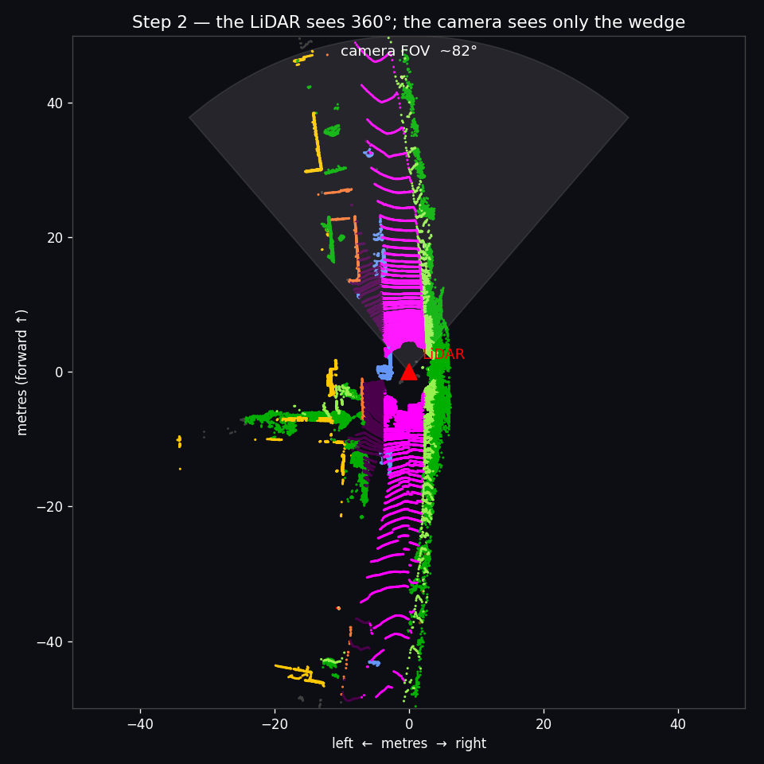
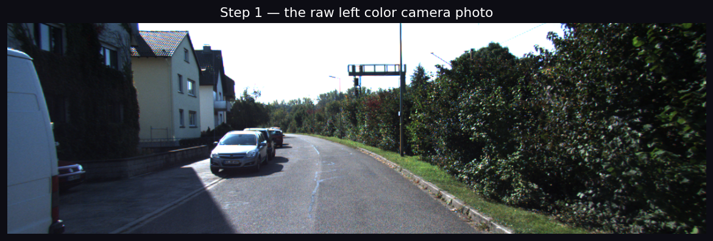
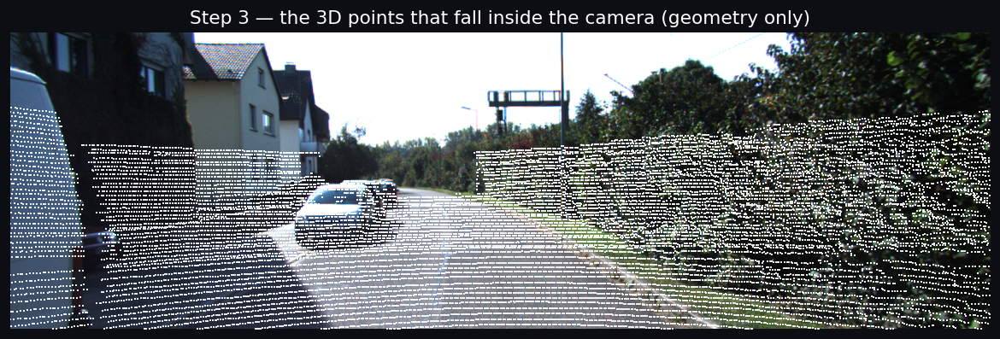
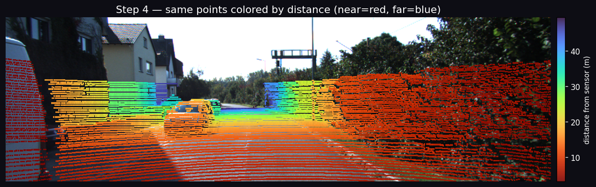
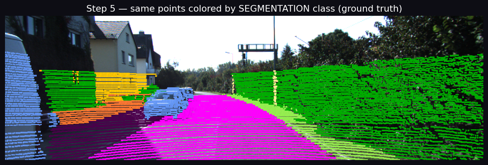
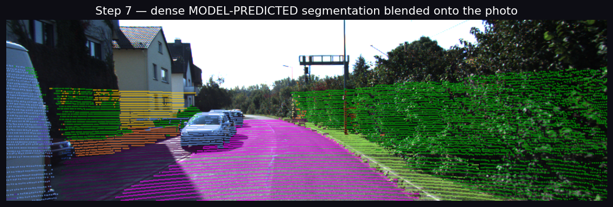
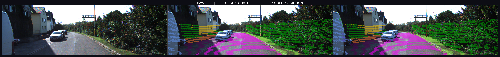
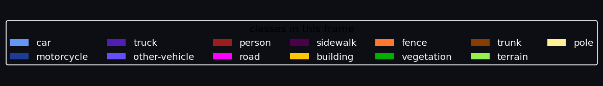
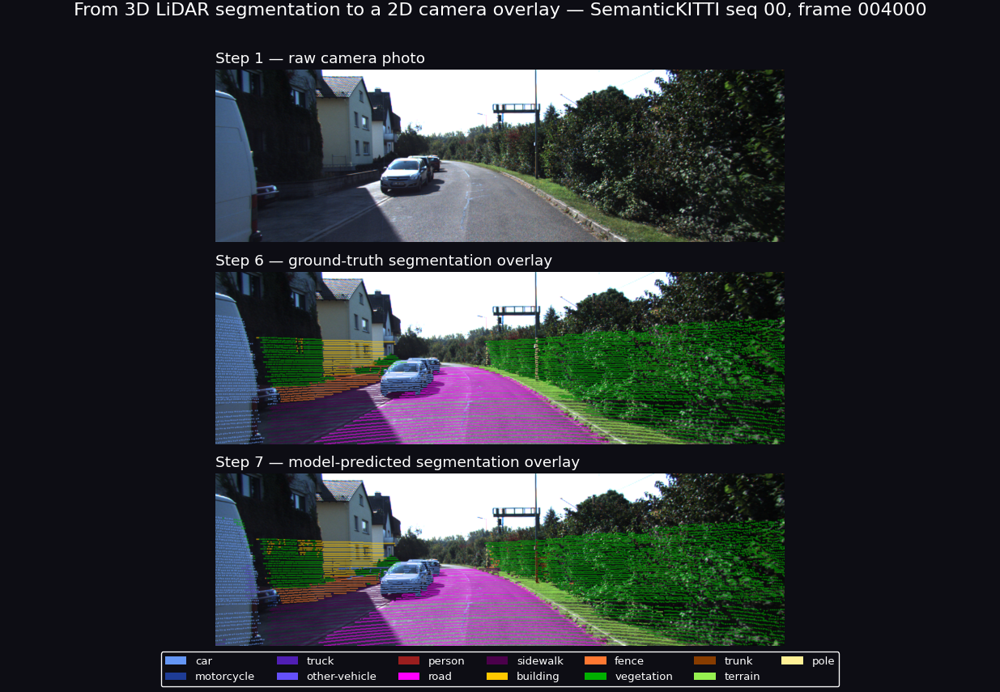

# Task (extra) — How a 3D LiDAR segmentation is drawn on a 2D camera photo

> You asked for a "perfect visualization, bit by bit" and a clear explanation of
> **how we put a LiDAR segmentation onto a flat camera image** — good enough to
> paste into a README. This doc is that. Every image below was generated by
> [`scripts/project_to_camera.py`](../scripts/project_to_camera.py) on
> SemanticKITTI seq 00, frame 004000, and lives in
> [`docs/images/`](images/).
>
> Regenerate any time with:
> ```bash
> cd ~/Autonomy/lidarseg && python3 scripts/project_to_camera.py --frame 004000
> # add --source gt to skip the model (no GPU needed)
> ```

---

## The core idea in one sentence

The LiDAR gives us a **3D point + a class** for ~125,000 points; the camera gives
us a **flat photo**. To draw the segmentation on the photo we ask, for each 3D
point, *"if this point were seen by the camera, which pixel would it hit?"* — then
paint that pixel with the point's class color. That "which pixel" question is
**projection**, and KITTI hands us the exact matrices to do it.

---

## Two sensors, two coordinate frames

The points and the photo live in **different coordinate systems**:

- **LiDAR (velodyne) frame** — origin at the laser, `x` forward, `y` left,
  `z` up. Points are here.
- **Camera frame** — origin at the camera, looking down its own `+z`. Pixels
  are here.

`calib.txt` gives the two matrices that bridge them:

| Matrix | Shape | Meaning |
|--------|-------|---------|
| `Tr` | 4×4 | rigid transform **velodyne → camera frame** (rotate + translate) |
| `P2` | 3×4 | **camera projection**: 3D camera-frame point → 2D pixel (contains the focal length, principal point, and the stereo-rig offset for cam 2) |

For frame seq-00 the real numbers are:
```
P2 = [718.86    0    607.19   45.38      # fx, cx, baseline·fx term
        0    718.86  185.22   -0.11      # fy, cy
        0      0       1       0.0038]    # → fx=fy=718.86 px, optical centre (607,185)
Tr = velodyne→camera  (a ~90° rotation: LiDAR x-forward becomes camera z-forward)
```

---

## The projection equation (the heart of it)

For one LiDAR point `X = [x, y, z]` (metres, velodyne frame), in **homogeneous**
form `[x, y, z, 1]`:

```
        ┌ u·s ┐
        │ v·s │  =  P2 · Tr · [x, y, z, 1]ᵀ
        └  s  ┘
```

Two steps are happening:

1. **`Tr · X` → camera frame.** Now the point is `[Xc, Yc, Zc]`, where **`Zc`
   is the depth** — how far in front of the camera it is.
2. **`P2 · (camera point)` → `[u·s, v·s, s]`.** This is a *perspective*
   projection. The third number `s` equals the depth, so we **divide by it** to
   get the actual pixel:

```
   u = (u·s) / s          v = (v·s) / s          depth = Zc
```

`(u, v)` is the pixel column/row. That division by depth is what makes far things
appear small and near things large — exactly how a real lens works. In code
([projection.py](../scripts/project_to_camera.py) `project()`):

```python
cam = (Tr @ [x, y, z, 1]ᵀ)          # → camera frame, depth = cam.z
uvw = (P2 @ cam)                     # → [u·s, v·s, s]
u, v = uvw[0]/uvw[2], uvw[1]/uvw[2]  # → pixel, divide by depth
```

---

## Why only ~15% of points show up: FOV culling

The LiDAR spins a full **360°**; the camera only looks **forward through a ~82°
window**. So most points are behind or beside the car and can never appear in the
photo. We keep a projected point only if **all** of these hold:

- `depth > 0.5 m` — it's actually *in front of* the camera (not behind it), and
- the pixel `(u, v)` lands **inside** the image (`0 ≤ u < 1241`, `0 ≤ v < 376`).

For this frame that's **19,181 of 125,528 points (15.3%)**. This picture makes it
obvious — the LiDAR sees everything; the shaded wedge is all the camera sees:



---

## Building the overlay, bit by bit

### Step 1 — the raw photo (the canvas)


### Step 3 — project the in-FOV points, geometry only
Each kept 3D point becomes one white dot. Notice the **horizontal stripes**:
those are the LiDAR's individual laser rings hitting the road and walls. This
panel proves the *geometry* is right before we add any color.


### Step 4 — color the dots by distance (a sanity check)
Near points red, far points blue. The smooth red→blue gradient from the
foreground road into the distance confirms the depth maths is correct — if `Tr`
or the divide-by-depth were wrong, this gradient would be scrambled.


### Step 5 — color the dots by their **segmentation class**
Now instead of distance, each dot uses its **class color** (road = magenta,
vegetation = green, car = light blue, building = yellow…). This *is* the LiDAR
segmentation, shown on the photo — just as sparse dots.


### Step 6 — make it dense and readable (the overlay)
Sparse dots are hard to read, so we turn them into a filled overlay with three
touches (in `dense_overlay()`):

1. **Painter's algorithm** — sort points **far → near** and draw far ones first,
   so nearer surfaces correctly paint *over* the things behind them.
2. **3×3 stamp** — draw each point as a small 3×3 square, not a single pixel, so
   the sparse cloud reads as continuous regions.
3. **Alpha blend (α≈0.55)** — mix the class color with the underlying photo so
   you still see the scene through the segmentation.


### Step 7 — the same, but from the **model's prediction**
Everything above used the ground-truth labels. Swap in the model's per-point
predictions and you get the live result — what the network actually thinks:


---

## The money shot: RAW | GROUND TRUTH | PREDICTION

Side by side, you can eyeball where the epoch-5 model agrees with truth (road,
vegetation, building) and where it's still weak (the car, small objects):



Class color key:



---

## The full pipeline (README hero image)



---

## Notes for putting these in a README

- All paths above are **relative** (`images/…`), so they render correctly when
  this file sits next to its `images/` folder. From the project root README, use
  `docs/images/…` instead (see the main [README](../README.md)).
- To render on **GitHub**, the `images/` folder must be **committed inside the
  repo** you're viewing. These currently live under `~/Autonomy/lidarseg/`; if
  your published repo is elsewhere (e.g. the `SpaceRocket/.../AL` git repo), copy
  `docs/images/` into it and keep the relative links.
- `compare_raw_gt_pred.png` is the widest/heaviest (~2 MB). For a README banner,
  `pipeline.png` (stacked) usually reads better than the wide trio.
- Want a different scene? `--frame 000750` (busier traffic) or any 6-digit id in
  `sequences/00/`. Re-run and the same filenames are overwritten.

---

## Recap

```
3D point [x,y,z]  ──Tr──►  camera frame [Xc,Yc,Zc]  ──P2──►  [u·s, v·s, s]
                                              depth = Zc           │ ÷ s
                                                                   ▼
                              keep if depth>0.5 and inside image → pixel (u,v)
                                                                   │ class color
                              far→near paint, 3×3 stamp, α-blend ──┘ → overlay
```

That's the whole trick: **one matrix multiply per point, divide by depth, cull to
the frustum, paint nearest-last.** Next door,
[03_class_weighting.md](03_class_weighting.md) explains the `CLASS_WEIGHT[0]=5.0`
question, and [04_evaluation_miou.md](04_evaluation_miou.md) covers measuring how
good these predictions really are.
