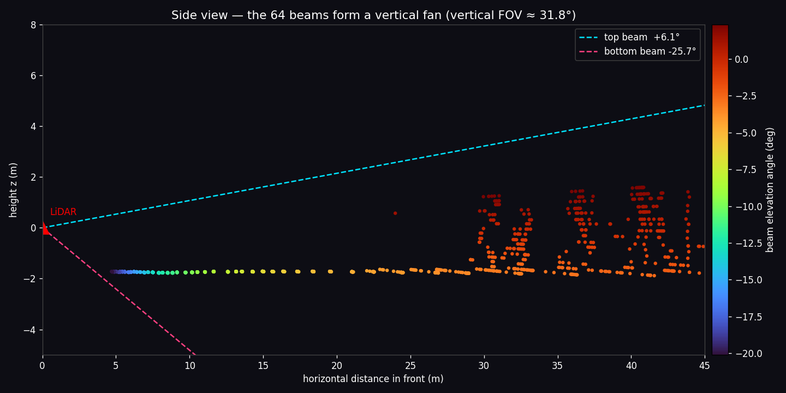
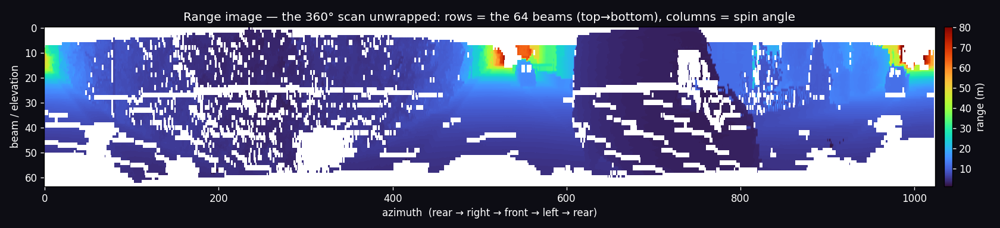
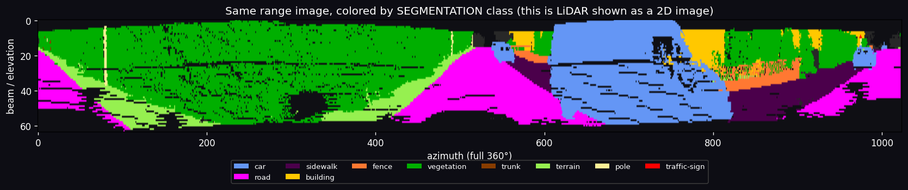

# Task (extra) — The sensor geometry: what the Velodyne actually sees

> You said: *"we have a 3D cam and a Velodyne LiDAR that isn't just 360°
> horizontal but ~30° vertical too."* That's the right instinct — let's make it
> precise and visual. Everything below is **measured from the actual points** of
> SemanticKITTI seq 00 frame 004000 by
> [`scripts/sensor_geometry.py`](../scripts/sensor_geometry.py) (no model, no GPU):
>
> ```
> 125,528 points
> vertical FOV : +6.1° (up)  →  −25.7° (down)   = 31.8° tall
> horizontal   : full 360°
> range        : 1.2 m near  →  80 m far
> ~points/beam : 1,961  (× 64 beams ≈ 125k)
> ```

---

## First, one correction: there is **no "3D camera"**

KITTI's sensor roof has **two kinds of sensor**, and only one of them is 3D:

| Sensor | What it gives | 2D or 3D? |
|--------|---------------|-----------|
| **Velodyne HDL-64E LiDAR** | a 3D point cloud (x, y, z + intensity) | **3D** |
| **Cameras** (2 grayscale + 2 color, in stereo pairs) | flat photos | **2D** |

The cameras are **ordinary 2D cameras** — not depth/RGB-D cameras. KITTI has a
*stereo pair* (left + right), and in principle stereo *can* estimate depth, but
**we never use that**: in this project the camera is only a normal 2D photo (the
left color camera, "cam 2") that we paint the segmentation onto
([docs/05](05_lidar_to_camera_projection.md)). **All the 3D in this project comes
from the LiDAR.** So: 1 LiDAR doing the 3D sensing, 1 plain 2D photo for display.

---

## How the Velodyne HDL-64E works (the mental model)

Picture a **vertical stack of 64 laser beams**, each fixed at a slightly
different up/down angle, mounted on a head that **spins around 10 times a
second**. As it spins:

- each of the 64 lasers sweeps out one **horizontal circle** → a **"ring"**,
- 64 lasers → **64 rings**, nested like ripples on a pond,
- one full 360° turn (~0.1 s) = **one frame** ≈ 125,000 points.

So the beams form a **vertical fan** that rotates. Your "30° vertical" is spot on:
the fan here spans **31.8°** top-to-bottom (the nominal HDL-64E spec is ~26.9°,
from +2° to −24.9°; the slightly larger measured number includes a few edge
returns). Crucially the fan points **mostly downward** — from about **+6° up to
−26° down** — because the sensor sits ~1.7 m up on the roof and the interesting
stuff (road, cars, curbs) is *below* it. It can barely see above horizontal, so
the **sky and the tops of nearby tall buildings are simply not measured**.

### See the fan from the side
A thin front-facing slice of the scan, plotting *distance ahead* vs *height*,
each point colored by which beam (elevation angle) produced it:



Read it like this:
- The **flat line at z ≈ −1.7 m** is the **road** — that's the sensor's height
  above the ground (the LiDAR is the origin, the road is 1.7 m below it).
- **Steep-down beams** (purple/blue, ≈ −20°) hit the road **close** to the car;
  **shallow beams** (orange/red, near 0°) reach the road **far away**. That's why
  a flat road turns into a series of rings at increasing distance.
- The vertical clumps at 30–45 m are **buildings/vegetation** — the only things
  tall enough to catch the near-horizontal beams.
- The dashed lines are the **top (+6.1°)** and **bottom (−25.7°)** beam
  directions — the edges of the vertical FOV.

---

## Why the data looks "striped" and gets sparse far away

Two consequences of this geometry explain almost everything you see:

1. **Rings / scan-lines.** Because the data is 64 discrete beams, projecting it
   onto the camera (or the ground) shows **horizontal stripes** — each stripe is
   one beam. You saw exactly this in
   [docs/05 step 3/4](05_lidar_to_camera_projection.md).
2. **Density falls with distance.** The beams **fan apart** as they travel, so
   two neighbouring rings that are ~10 cm apart at 5 m are **several metres apart
   at 40 m**. Near the car the ground is densely sampled; far away points are
   sparse. This is *the* reason far/small objects (a distant pole, a traffic
   sign) get only a handful of points and are hard to segment — and it's exactly
   why Cylinder3D voxelizes in **cylindrical** coordinates, whose cells grow with
   range to keep a more even number of points per cell
   ([docs/01 §8](01_dataset_preparation.md), [docs/02 §1](02_model_and_training.md)).

---

## LiDAR as a 2D image (the bridge from your 2D-vision world)

Here's the connection to everything you already know. Because every point has an
**azimuth** (spin angle) and an **elevation** (which beam), you can **unwrap** the
whole 360° scan into a flat 2D image — a "**range image**":

- **rows** = the 64 beams, top beam at the top, bottom beam at the bottom,
- **columns** = the spin angle (rear → right → front → left → rear),
- **pixel value** = the range (or the class).

Colored by distance:



Colored by **segmentation class** — *this is the LiDAR shown as a normal 2D
image*:



Notice how readable it is: **magenta road fills the bottom rows** (the down-beams
hit the ground), **green vegetation and yellow buildings sit higher up**, **blue
cars** appear as blobs, and the **top rows are empty** where beams shot above
everything into the sky. A whole family of LiDAR methods (RangeNet++, SqueezeSeg)
segment *this* 2D image with ordinary 2D CNNs — so your image background transfers
directly.

> **But note:** our model, **Cylinder3D, does *not* use the range image.** It
> works on the true 3D points in cylindrical voxels. The range image here is a
> *teaching/representation* tool — a great way to *see* the data, and an
> alternative approach you could explore later.

---

## Every number on a point, and what it means

One LiDAR point = **4 floats**: `(x, y, z, intensity)`.

| field | unit | meaning | useful for |
|-------|------|---------|-----------|
| `x` | m | forward | where things are |
| `y` | m | left | where things are |
| `z` | m | up | **height** → road vs wall vs overhang |
| `intensity` | 0–1 | how strongly the laser returned | road paint, signs, plates reflect strongly |

(Plus, derived: **range** `√(x²+y²+z²)`, **azimuth** `atan2(y,x)`, **elevation**
`atan2(z,√(x²+y²))` — what the range image uses.)

There is **no color** on a LiDAR point — color only exists in the separate camera
photo. That's the whole reason the camera overlay in
[docs/05](05_lidar_to_camera_projection.md) is a *fusion* of the two sensors.

---

## Recap

```
64 lasers stacked vertically  ┐
spinning head @ 10 Hz         ├─►  64 rings × 360°  =  ~125k points / frame
vertical FOV ≈ 31.8° (mostly  ┘                         each = (x,y,z,intensity)
  DOWN: +6° … −26°)
        │
        ├─ beams fan out  ⇒  dense near, sparse far  ⇒  far/small objects are hard
        ├─ 64 discrete beams ⇒ "stripes/rings" in projections
        └─ unwrap (beam × azimuth) ⇒ a 2D "range image" you can view & even CNN

camera = plain 2D photo (no depth used);  all 3D = LiDAR
```

Regenerate for any frame: `python3 scripts/sensor_geometry.py --frame 000750`.
Back to the data basics in [docs/01](01_dataset_preparation.md), or see
**[08_how_distance_works.md](08_how_distance_works.md)** for *how the range itself
is measured* (time-of-flight) and a by-the-numbers portrait of the dataset.
