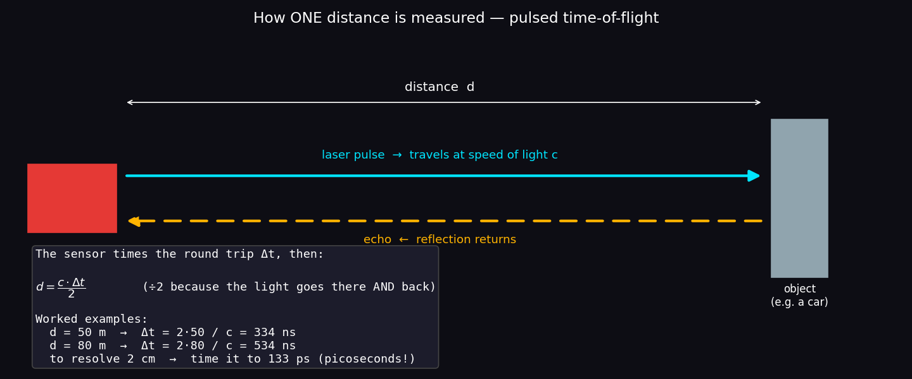
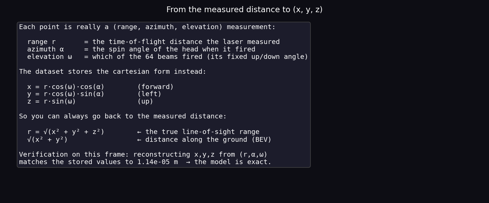
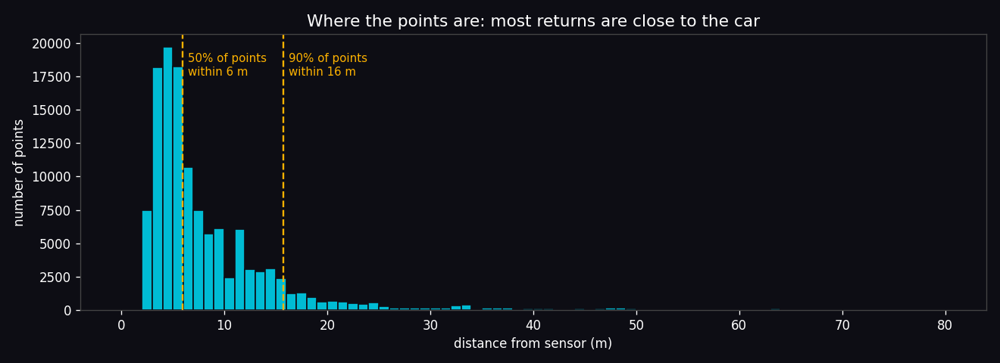
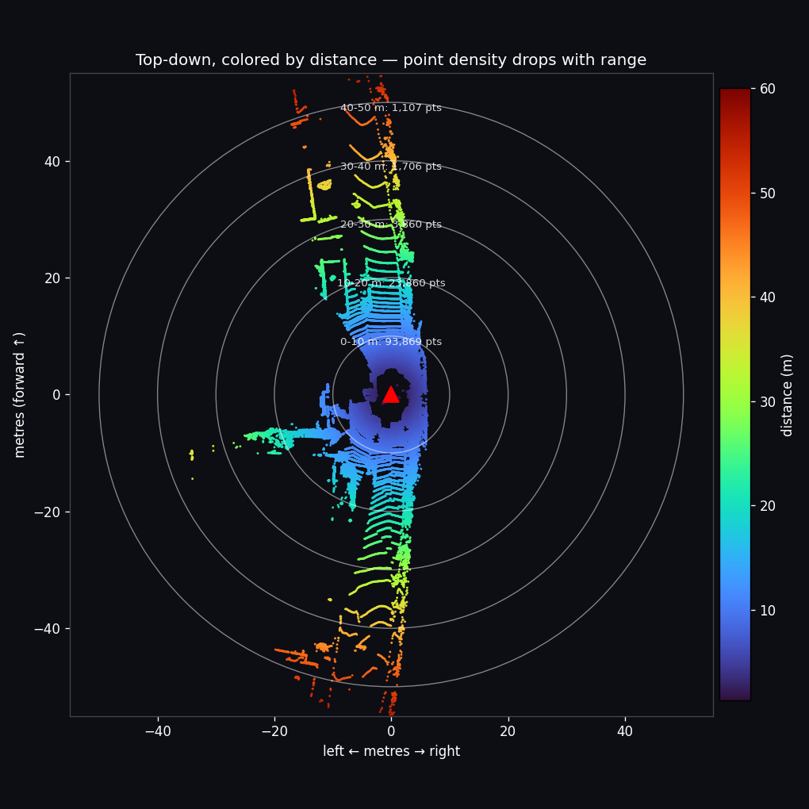
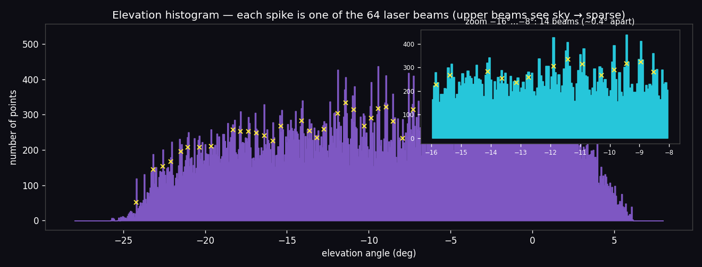

# Task (extra) — How distance is actually measured, and the dataset by the numbers

> You asked: *how is the distance actually calculated, and can we represent the
> dataset more/better?* This doc answers both — the **physics of one distance**,
> the **math that turns it into (x,y,z)**, and a **statistical portrait** of what
> the data really looks like. Everything is measured from frame 004000 by
> [`scripts/dataset_overview.py`](../scripts/dataset_overview.py) (no model, no GPU):
>
> ```
> 125,528 points
> range: min 1.29 m   median 5.9 m   max 80.5 m
> 50% of all points are within 5.9 m,  90% within 15.7 m
> ```

---

## 1. One distance = one timed echo (time-of-flight)

A LiDAR measures distance the way a bat or sonar does, but with **light**. It
fires a very short laser pulse, and times how long until the reflection comes
back:



```
        c · Δt
   d = ────────          c = speed of light ≈ 3 × 10⁸ m/s,  Δt = round-trip time
          2
```

The `÷2` is because the light travels to the object **and back** — the round trip
is `2d`. That's the whole principle. What makes it remarkable is the **timing
precision required**:

| distance | round-trip time Δt |
|----------|--------------------|
| 50 m | **334 ns** (nanoseconds) |
| 80 m (the far edge of this scan) | 534 ns |
| **to resolve 2 cm** | the clock must tick to **~133 ps** (picoseconds) |

Light moves ~30 cm per nanosecond, so to place a point to a few centimetres the
electronics must time the echo to **hundreds of picoseconds**. That picosecond
stopwatch — repeated ~1.3 million times a second — is exactly why a spinning
LiDAR is a precise (and expensive) instrument. The strength of the returning
pulse is also recorded — that's the **intensity** channel.

> Aside: the Velodyne HDL-64E uses **pulsed** time-of-flight (time a sharp pulse).
> Some other LiDARs instead measure the **phase shift** of a modulated continuous
> beam, but the idea — turn a light delay into a distance — is the same.

---

## 2. From the measured distance to (x, y, z)

The sensor doesn't natively know `x, y, z`. For each return it knows three things:

- **range `r`** — the time-of-flight distance from §1,
- **azimuth `α`** — the spin angle of the head at the instant it fired,
- **elevation `ω`** — *which* of the 64 beams fired (each has a fixed up/down angle).

That's a point in **spherical coordinates**. It's converted to the cartesian
`(x, y, z)` the dataset stores with basic trigonometry:



```
x = r · cos(ω) · cos(α)      (forward)
y = r · cos(ω) · sin(α)      (left)
z = r · sin(ω)               (up)
```

And — the part that answers your question directly — you can always **invert** it
to recover the distance the sensor measured:

```
r          = √(x² + y² + z²)     ← the true line-of-sight range (what was timed)
√(x² + y²) =                      ← distance along the ground (the BEV/top-down distance)
```

So when earlier docs compute "distance," that's literally `√(x²+y²+z²)` — the
Euclidean length of the point's vector, which **equals** the timed range. The
script proves it: it reconstructs `x,y,z` from `(r, α, ω)` and matches the stored
values to **1.1 × 10⁻⁵ m** — i.e. the spherical model is exact; the tiny residual
is just `float32` rounding.

> Two "distances", don't mix them up: **range** `√(x²+y²+z²)` (slant distance,
> what the laser measured) vs **ground distance** `√(x²+y²)` (its shadow on the
> ground, used in the top-down view). For a point on the road 1.7 m below the
> sensor at 10 m ahead, range ≈ 10.14 m, ground distance = 10 m.

---

## 3. Representing the dataset better — the data by the numbers

Three measured views that build real intuition for what a scan *is*.

### a) Most points are close to the car
A histogram of every point's range. It's heavily skewed to the near field —
**half** the points are within **5.9 m**, and **90%** within **15.7 m**:



### b) Density collapses with distance
The same fact in space: a top-down view colored by distance, with range rings.
Count the points in each 10-metre band and the drop is dramatic:



```
0–10 m : ~93,900 points        ← three-quarters of the whole scan
10–20 m: ~17,800
20–30 m:  ~6,000
30–40 m:  ~1,700
40–50 m:  ~1,100
```

A car at 40 m might be only a **handful of points**, while the road at your bumper
has tens of thousands. This single fact explains a lot of the model's behaviour
(next section).

### c) The 64 beams are visible in the raw numbers
Take every point's elevation angle and histogram it: the data clumps into
**discrete spikes** — each spike is **one laser beam**. The upper beams shoot
toward the sky and rarely hit anything, so they're sparse; the lower beams hit the
nearby road and are dense. The zoom shows individual beams ~0.4° apart:



This is the same "64-beam fan" from [doc 07](07_sensor_geometry.md), but now
*derived purely from the stored x,y,z* — the geometry is really in the data.

---

## 4. Why this matters for segmentation

The distance/density facts above are not trivia — they shape the whole problem:

- **Far & small objects are starved of points.** A distant pole or sign gets a
  few returns, so it's genuinely hard to classify — and contributes almost
  nothing to point-accuracy while still costing you a full class in **mIoU**
  ([doc 04](04_evaluation_miou.md)). This is *why* the rare/far classes need help
  (more data, or class weighting — [doc 03](03_class_weighting.md)).
- **Density is wildly uneven near→far.** A plain cartesian voxel grid would be
  packed near the car and almost empty far away. That's the exact reason
  Cylinder3D uses **cylindrical** voxels that grow with range, keeping a more even
  number of points per cell ([doc 02](02_model_and_training.md)).
- **Intensity is a free extra signal.** Because the return strength is recorded,
  the model's input is `(x, y, z, intensity)` — reflectivity helps separate, e.g.,
  road paint and signs from matte surfaces.

---

## Recap

```
fire pulse → time the echo Δt → range d = c·Δt/2        (picosecond timing)
add the beam's elevation ω and the head's azimuth α
        → x=r·cosω·cosα,  y=r·cosω·sinα,  z=r·sinω        (stored in the .bin)
        → recover distance any time:  r = √(x²+y²+z²)

dataset shape: 50% of points < 6 m, 90% < 16 m  →  dense near, sparse far
               64 discrete beams visible in the elevation histogram
               consequences: far/small classes are hard; cylindrical voxels help
```

Regenerate for any frame: `python3 scripts/dataset_overview.py --frame 000750`.
See also [07_sensor_geometry.md](07_sensor_geometry.md) (the beams/FOV) and
[01_dataset_preparation.md](01_dataset_preparation.md) (the files & formats).
